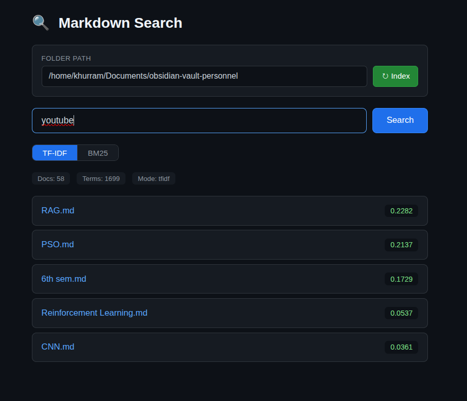
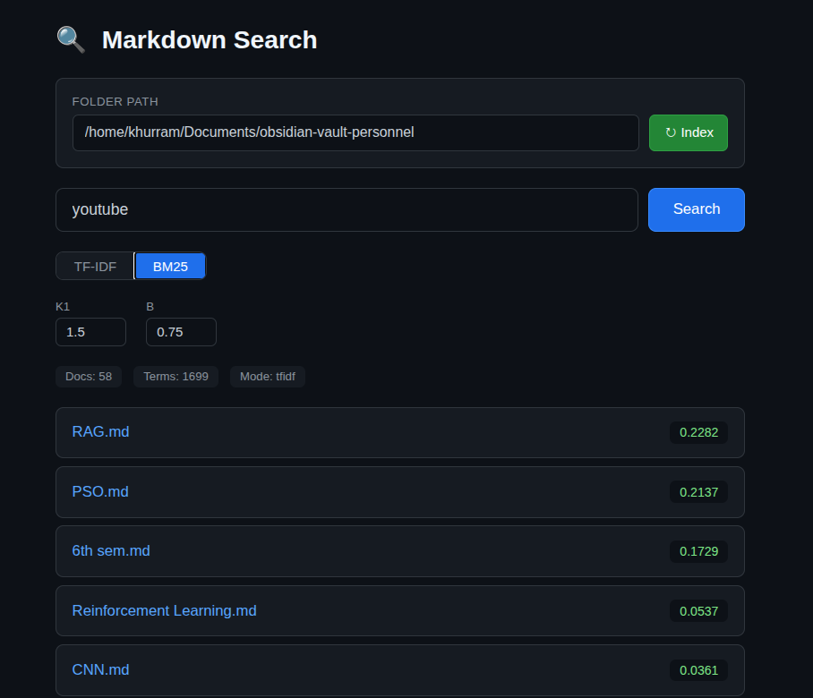

# markdown-search

TF-IDF / BM25 search engine for `.md` files with a web UI.

## Quick start

```bash
./run.sh /path/to/your/markdown/files
# open http://localhost:8080
```

Requires [uv](https://docs.astral.sh/uv/).

## Usage

**Web UI**
```bash
./run.sh ~/notes          # index and serve
./run.sh                  # set folder from the UI instead
```

**CLI**
```bash
uv run python search.py ~/notes           # TF-IDF
uv run python search.py ~/notes --bm25    # BM25
```

## Screenshots

<table>
<tr>
<td></td>
<td></td>
</tr>
</table>

## Features

- Preprocessing: markdown stripping, stopword removal, lemmatization (NLTK)
- Scoring modes: TF-IDF (cosine similarity) or BM25
- BM25 parameters `--k1` and `--b` adjustable in the UI
- Zero external dependencies beyond NLTK and `uv`
